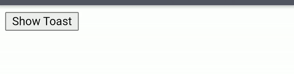

# website-component 📚
This repo includes frequently used web component for general websites.
Best Repo To Start Your Basics Website.
In This Repo All Things Are Available You Need To Know.
In-short The Best Repo For Small Project Like Webiste And Etc.

# Contributing Guidelines
This library is open-source so, You can add any of your components to this library.
## Steps to add Your component(s).

### 0. Star the repo.

### 1. Fork the repo.
You can make a copy of the project to your account. This process is called forking a project to your Github account. This creates a separate copy for you to work on.

### 2. Clone the forked project.
You have forked the project you want to contribute to your github account. To get this project on your development machine we use clone command of git.

$ git clone https://github.com/dev-sumanpandit/website-component

### 3. Make changes
Make changes in you fork by adding your components.

### 4. Push Code and Create a Pull Request 
You now have a new branch containing the modifications you want in the project you forked. Now, push your new branch to your remote github fork.

$ git push origin <feature-branch> Now you are ready to help the project by opening a pull request means you now tell the project managers to add the feature or bug fix to original repository. Make pull request to this repo with your fork.

Remember your upstream base branch should be main and source should be your feature branch. Click on create pull request and add a name to your pull request. You can also describe your feature.

# Components added recently.

  
Accordian
  

<H1>Accordian by @CrackerSuman</H1>
<H2>Directory structure</H2>
<pre><code>
   repo/accrodian/
                 /style.css (*style)
                 /index.html (demo)
<pre></code>

  
  
Pagination
 
 
<H1>Pagination by @dev-sumanpandit</H1>
<H2>Directory</H2>
<pre><code>
   repo/Pagination/
                  /style.css (*style)
                  /index.html (demo)
<pre></code>

  
Toast
  

<H1>toast by @SGI-CAPP-AT2</H1>
<H2>Directory</H2>
<pre><code>
   repo/toast/
             /app.js (*script)
             /style.css (*style)
             /index.html (demo)
</pre></code>

## Implemention of components
For implementing any components of the repo download the (*) required files of the components and implemente it as it is implemented in demo files.
> Required files are denoted with (*)
