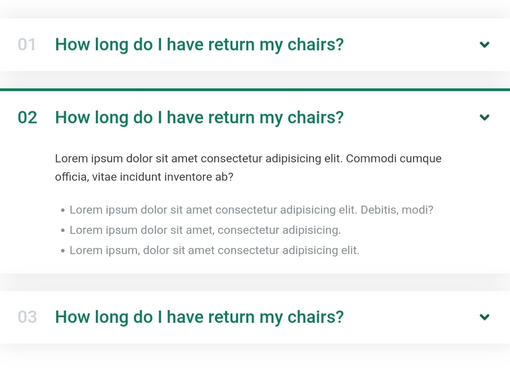
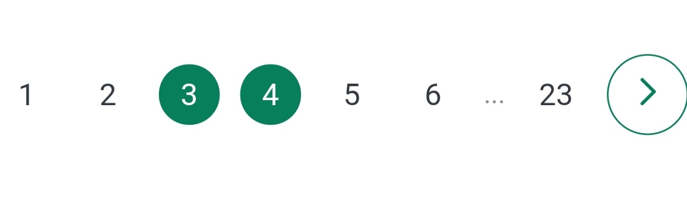

# website-component 📚
This repo includes frequently used web component for general websites.
Best Repo To Start Your Basics Website.
In This Repo All Things Are Available You Need To Know.
In-short The Best Repo For Small Project Like Webiste And Etc.
# Contribute
This library is open-source so, You can add any of your components to this library.
## Steps to add Your component(s).
### 0. Start the repo.
### 1. Fork the repo.
After forking the repo you will obtain a copy of the repo in which you can make changes.
### 2. Make changes
Make changes in you fork by adding your components.
### 3. Generate a pr 
Make pull request to this repo with your fork.
# Components added recently.

  
Accordian
  

<H1>Accordian by @CrackerSuman</H1>
<H2>Directory structure</H2>
<pre><code>
   repo/accrodian/
                 /style.css (*style)
                 /index.html (demo)
<pre></code>

  
  
Pagination
 
 
<H1>Pagination by @dev-sumanpandit</H1>
<H2>Directory</H2>
<pre><code>
   repo/Pagination/
                  /style.css (*style)
                  /index.html (demo)
<pre></code>

  
Toast
  

<H1>toast by @SGI-CAPP-AT2</H1>
<H2>Directory</H2>
<pre><code>
   repo/toast/
             /app.js (*script)
             /style.css (*style)
             /index.html (demo)
</pre></code>

## Implemention of components
For imImplementing any components of the repo download the (*) required files of the components and implemente it as it is implemented in demo files.
> Required files are denoted with (*)
